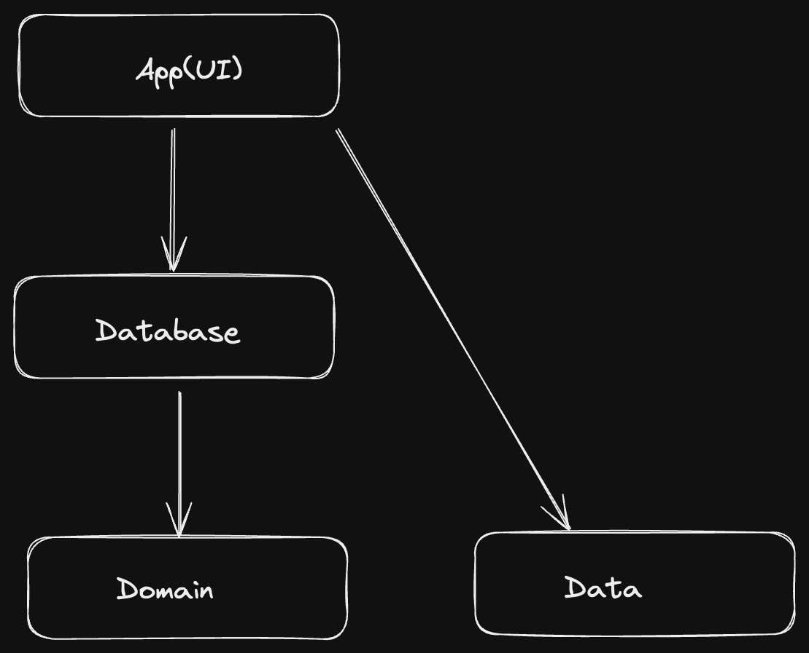
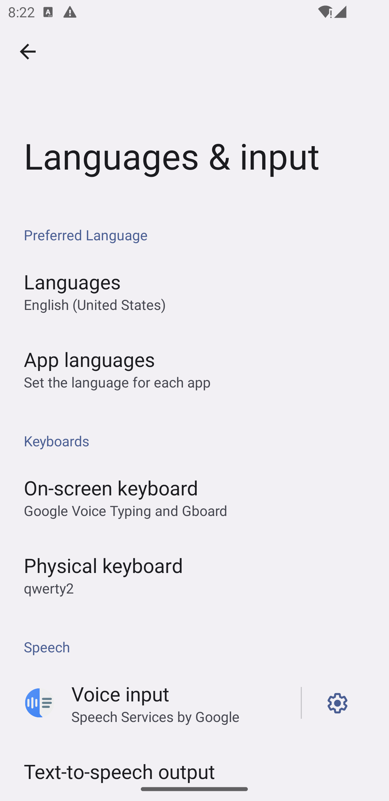
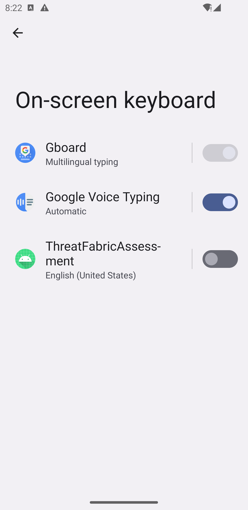
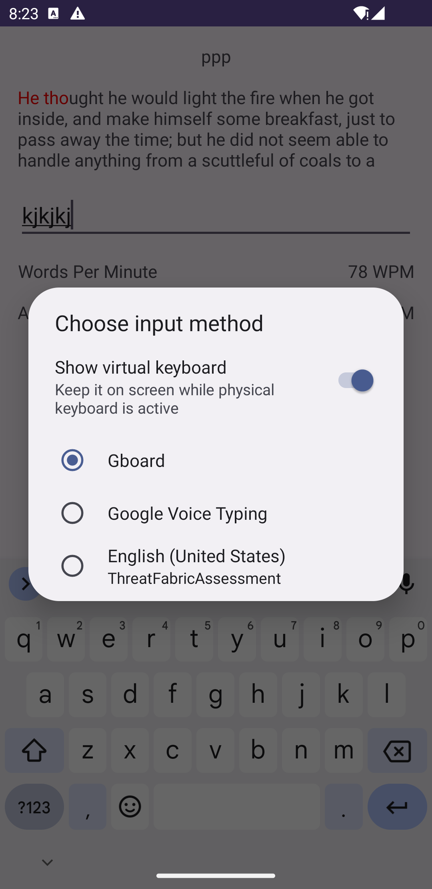
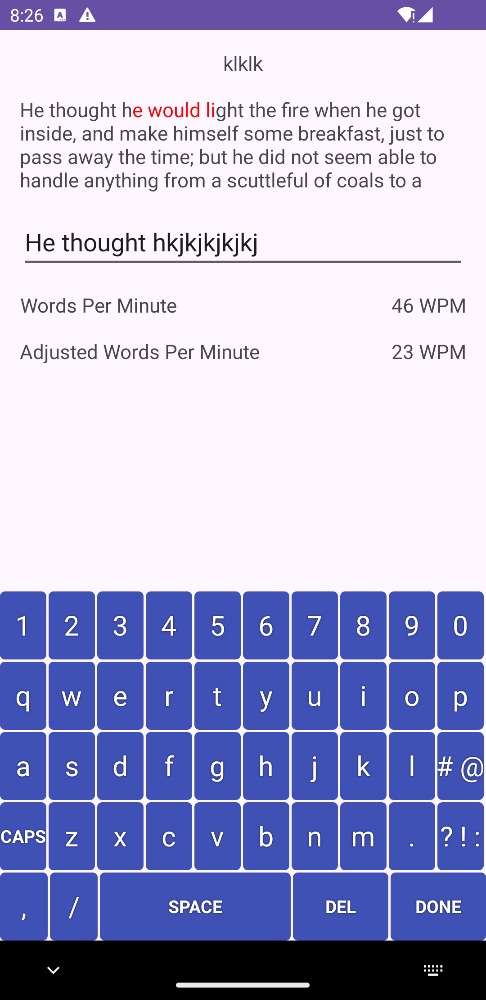

# Threat Fabric assignment
## Keyboard analytics
Sample app to measure a user's typing speed in WPM (Word Per Minute) in real-time.

## Requirements

- The backspace key should be prevented
- After typing started, the app should start observing Keystroke events, generating
  behavior analytics with these events, and saving them into local DB.
- The app should use this database and calculate the WPM in real-time.
- The wrong typed texts should be indicated in the paragraph (Underlined or with
  different text color)
- If the user pauses to type, the app should stop calculating wpm until the user starts to
  type again

## Architecture
This application is built using clean architecture principles, by dividing the system into layers, with dependencies pointing inward. At the core is the domain layer, where the core business logic resides, and the outer layers handle interactions with the system's inputs, outputs and framework

We have the following layers:
# 1. Domain Layer
This Contains the core business contracts and models, it Defines core entities such as TypingEvent, WordEvent, and core business logic like calculating error counts.
It encapsulates application-specific business logic. In this case, a TypingUseCase would handle the interactions between the app's UI and data by coordinating processes such as capturing typing events, calculating WPM, and managing words typed.
Entities:
- TypingEvent: Represents a keypress event with details like key code and timing information.
- WordEvent: Tracks words typed, timing, username, and error counts.
  Use Cases:
  TypingUseCase: Interacts with the repository to manage typing data and analytics.

# 2. DB Layer
This is responsible for data management and persistence. It contains the repository implementation for Room database. It representss data at rest (e.g. database models) using room database, it provides local storage, where entities like TypingEventEntity and TypingWordsEntity map to tables in the database.
It also contains mappers to transform domain objects to data objects (and vice versa), ensuring domain layer doesn't depend directly on Room entities.
It implements the repository, interacting with Room DAOs.

# 3. App(UI) Layer
The app follows the MVI (Model-View-Intent) pattern to structure its logic, providing clear separation of concerns and an efficient flow of data. Here we use MVI architecture.

Breakdown:
Model: The Model represents the state of the app and the business logic. It encapsulates all the data required by the view, such as typing events, word events, and calculated analytics like WPM (words per minute). The state is immutable, ensuring that every change leads to a new version of the view state.

For example, in the app, the TypingEffect sends information like the number of errors made during typing, while the TypingEffect holds current words-per-minute, and adjusted WPM after error correction. The View is responsible for rendering the UI based on the current state. In this app, the fragment is the view layer that reacts to changes in the TypingState, updating elements like text input fields, underlining errors, and displaying the calculated WPM.

The ViewModel provides a single source of truth by exposing the state and effects to the view, which subscribes to state changes and reacts accordingly. The Fragment subscribes to these updates and ensures real-time interaction, such as displaying underlined text for correct/incorrect characters.

Intent: The Intent captures the user’s interactions, such as keystrokes and any actions that trigger updates to the state. These events flow into the ViewModel, which processes them through various business logic functions, updating the state.

For instance, when a user types a character, an Intent is dispatched (e.g., TypingUIEvent.TextTyped) to notify the ViewModel. This triggers the necessary processing, such as saving the keystroke, checking against reference text for errors, and updating the database accordingly.

# Algorithm
Calculating WPM as the user types uses this formula.
>Total Number of Words = Total Keys Pressed / 5
WPM = Total Number of Words / Time Elapsed in Minutes (rounded down)
Adjusted WPM = (Total Number of Words - errors) / Time Elapsed in Minutes

This is a method used by many top platforms that calculate WPM, it takes an assumption of 5 letter per word,

Sources:
[Typing.com](https://www.typing.com/)
[Speedtypingonline](https://www.speedtypingonline.com/typing-equations)
[Typetolearn](https://www.typetolearn.app/)

# Constraints
The android soft-keyboard(on-screen keyboard) does not return all key events according to [Android documentation](https://developer.android.com/reference/android/view/KeyEvent.html). Excerpt below.
> As soft input methods can use multiple and inventive ways of inputting text, there is no guarantee that any key press on a soft keyboard will generate a key event: this is left to the IME's discretion, and in fact sending such events is discouraged. You should never rely on receiving KeyEvents for any key on a soft input method. In particular, the default software keyboard will never send any key event to any application targetting Jelly Bean or later, and will only send events for some presses of the delete and return keys to applications targetting Ice Cream Sandwich or earlier. Be aware that other software input methods may never send key events regardless of the version.

This means that:
- Certain events e.g backspace may not always be returned as a key event making it hard to detect and block.
- Using a hardware keyboard(bluetooth or computer keyboard with an emulator/physical device) should work just fine.

However, this project contains a workaround this issue.
- Using a combination of onTextChanged listeners in the case where the tester opts for the on-screen keyboard
- Creating a custom keyboard with an [Input Service](https://developer.android.com/reference/android/inputmethodservice/InputMethodService) which the user has to enable from Settings after installing the app(screenshot provided below). This allows complete reading of all the key events.

  

## Tech
This project uses a number of libaries :

- [RoomDB](https://developer.android.com/reference/androidx/room/RoomDatabase) - a persistence library in Android that provides an abstraction layer over SQLite
- [Coroutine Flow](https://developer.android.com/kotlin/flow?hl=en) -
- [Turbine](https://github.com/cashapp/turbine) - Thin wrapper over a Channel with an API designed for testing.
- [Mockk](https://mockk.io/) - mocking library for Kotlin
- [Intrumented Tests with JUnit Runner](https://developer.android.com/reference/androidx/test/runner/AndroidJUnitRunner) - evented I/O for the backend
- [Kotlin] - duh

## Improvements
- Complete customization of custom keyboards.
- Prompt user to use custom keyboard on app launch

